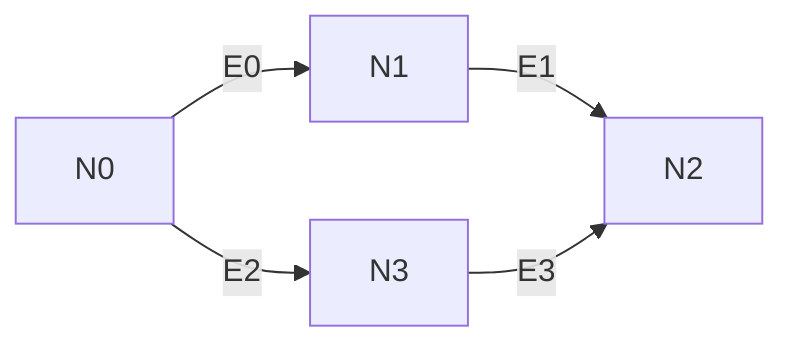

# Design

## Assumptions

We assume that:

* This implementation is needed only for single-threaded use
  cases. Hence we always know that no one else concurrently
  mutates our graph.
* The graph is not "reactive", which means we have to call the
  `compute` function manually to get the most up-to-date value.
* We know that our computational graph won't have cycles, but
  this is not enforced on a type level, so we can only check
  that a graph doesn't have any cycles at runtime.

## Data representation

The Direct Acyclic Graph (DAG) is the recursive data structure.
We could think of two possible designs/encodings of such a graph:

1) One that uses (smart) pointers of some kind.
2) Another that is based on vectors and indices.

Each has its *pros* and *cons*.

### 1. Pointers

The first question is: what kind of pointer to use?

1. Since graphs can be cyclic (graphs with cycles are
   constructible from the compiler/typechecker perspective)
   we can't use `Box<Node>` that works fine for data structures like
   lists and trees. Also if we have a shared references to
   the `Box<Node>` then we can not mutate the `Node` inside the "box".
2. Using some kind of `*mut Node` is not an option because it is
   simply dangerous and ignores all the benefits of Rust
   language type system.
3. `RefCell` is a good use case for things like graphs and trees
   assuming that we don't need to do aliasing and mutation
   between multiple threads. We can use a `RefCell` to get a
   safe "dynamically checked borrowing" (borrowing that is
   cheked at runtime). Combining `Rc` smart pointer with a
   `RefCell` smart pointer allows us to have multiple owners of
   mutable data.
4. We could also use `UnsafeCell`. It might be slightly more
   efficient than `RefCell`, but at the same time could be error
   prone and less ergonomic.

With `Rc<RefCell<Node>>` ergonomics suffers a little,
but it looks like the best option we have.

Because our graph might have cycles we need to prevent circular
references between `Rc` pointers, since mutual owning references
would never allow either `Rc` to be dropped. In a simple words
`Rc` pointers can not detect cycles. So if there is a cycle in
our graph, the reference counter will never fall to zero and the
graph will never be deallocated. We can solve this by using
`Weak` pointers in our graph or by manually breaking cycles
before destroying the graph. The former is more reliable. `Weak`
pointer is a version of `Rc` that holds a non-owning reference
to the managed allocation.

#### Summary

*Pros*:

* Easier to implemenent (?)
* Flexible (nodes of the graph can be easiliy reused
  outside the graph since they are ref-counted)

*Cons*:

* Only suitable for single-threaded use cases
* Uses interior mutability
* Not so good ergonomics
* Efficiency (separate allocation is need for every node)

### 2. Vectors and indices

The idea is to represent pointers to nodes using indexes
instead of "real" pointers.

With this approach our graph `G = (V, E)` will consist of:

* `V` - Vector of nodes
* `E` - Vector of edges

In Rust it'll look like this:

```
pub struct Graph {
    nodes: Vec<Node>,
    edges: Vec<Edge>,
}
```

Each `Node` and `Edge` can be identified by an index:

```
pub type NodeIx = usize;
pub type EdgeIx = usize;
```

Each node might contain an edge index,
which is the start of a linked list of outgoing edges.

```
type struct Node {
   edge: Option<EdgeIx>
}
```

Edges could be represented like this:

```
pub struct Edge {
   node: NodeIx,
   next: Option<EdgeIx>,
}
```

Here an edge contains an index of the target node and
an optional index of the next outgoing edge.

Consider the following example graph:



Using our data structures defined above
it could be represented like this:

```rust
n0 = Node { edge: Some(e0) }
n1 = Node { edge: Some(e1) }
n2 = Node { edge: None }
n3 = Node { edge: Some(e2) }
```

```rust
e0 = Edge { node: n1, edge: Some(e2) }
e1 = Edge { node: n2, edge: None }
e2 = Edge { node: n3, edge: None }
e3 = Edge { node: n2, edge: None }
```

#### Summary

*Pros*:

* More efficient, data structure is compact,
  additions to graph have complexitiy O(1).
* Uses inherited mutability.
* Play well with multithreaded code,
  graph can be sent between threads.

*Cons*:

* Things get harder if you need to remove nodes
  (either you reuse the node/edge indices or leave a placeholder).
* There is a chance of misusing indices between graphs
  (not really a practical issue).

## Conclusion

I have decided to go with the first approach that uses pointers and interior mutability. For a real library I would try to implement an alternative design/encoding that uses vectors and indices as well, possibly adding some benchmarks.
