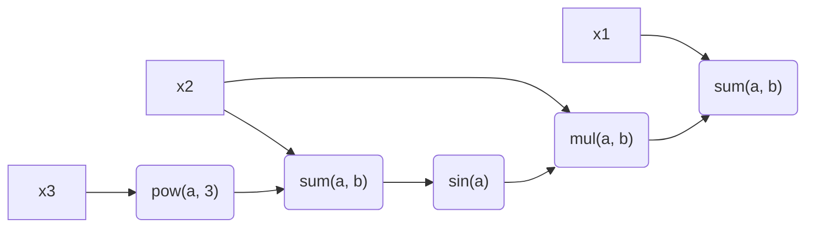

# Computational graph test

## Rationale

❔ This is a test assignment

💡 Note that this is a recruitment test, not a real library.
Hence I'm going to spend minimal effort on an implementation that solves the
problem.

## Problem

Computational graph is a direct acyclic graph (DAG), where each node takes one or
multiple inputs and produces one or more outputs. All inputs and outputs are
floating point values (`f32`).

For example:

```
y = x1 + x2 * sin(x2 + pow(x3, 3))
```

where `x1`, `x2`, `x3` are computational graph inputs, `3` is the exponent for
power function and `y` is a graph output.

The corresponding diagram for the above example is the following:



The task is to create a computational graph structure which can:
1. Take an arbitrary number of inputs
2. Can hold arbitrary graph of operations
3. Can compute a graph with `compute()` method
4. Each node should have its own cache (the result of `compute()` method) and
   should invalidate *caches* of dependent nodes. For example, if `x1` changes
   in the above example only the last `sum(a, b)` has to be recomputed.
